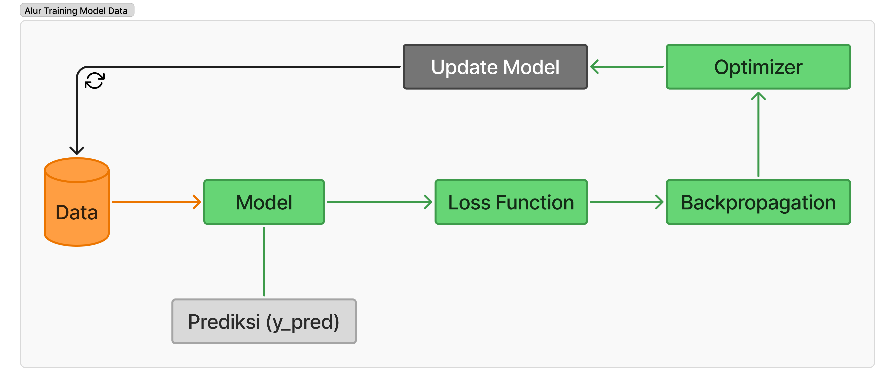
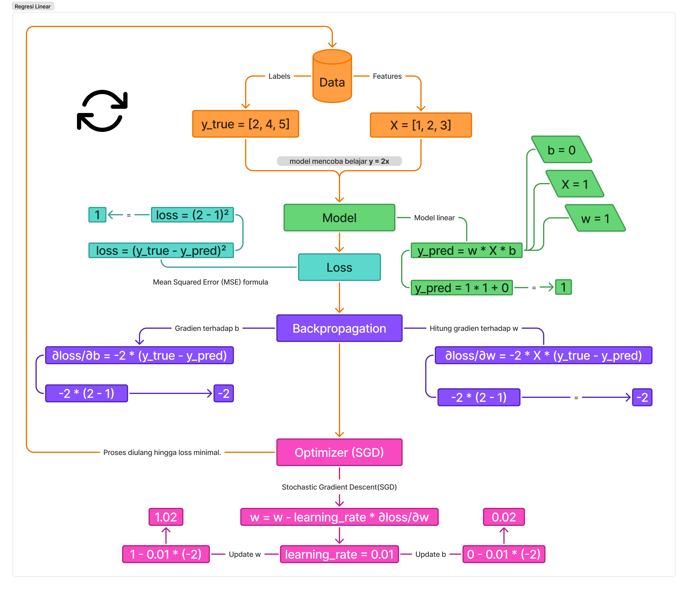

# Alur Training Model 

Alur training model machine learning adalah proses yang dilakukan untuk melatih model agar dapat membuat prediksi atau klasifikasi berdasarkan data yang diberikan. Proses ini melibatkan beberapa langkah penting yang harus diikuti secara berurutan. Berikut adalah diagarm alur training model ml khususnya untuk supervised learning:

## Data
Data dibagi menjadi tiga yaitu training set, validation set, dan test set. Features (X) dan Labels (Y) di pisahkan. Data dinormalisasi agar kompatibel dengan model

## Model
Model adalah representasi matematis dengan parameter weight (w) dan bias (b). contoh model linear regression adalah `y = wx + b. `

## Forward Pass (prediksi)
Model menerima input (features) dan menghasilkan output (prediksi).

## Loss Function
Loss function mengukur seberapa salah prediksi model dibandingkan model dibanding label asli. Salah satu contoh loss function adalah Mean Squared Error (MSE).

## Backpropagation
Menghitung gradien (turunan loss terhadap parameter model) menggunakan chain rule. Contoh gradien `∂loss/∂w` dan `∂loss/∂b `untuk model linear.

## Optimization
Optimasi dilakukan untuk memperbarui parameter model (w dan b) menggunakan algoritma optimasi seperti Stochastic Gradient Descent (SGD). Contoh update parameter `w = w - learning_rate * ∂loss/∂w` dan `b = b - learning_rate * ∂loss/∂b`.

## Training Loop
Training loop adalah proses iteratif yang dilakukan selama beberapa epoch. Pada setiap epoch, model dilatih dengan data training, loss dihitung, backpropagation dilakukan, dan parameter model diperbarui. Proses ini diulang hingga model mencapai performa yang diinginkan atau jumlah epoch yang telah ditentukan.

# Contoh Regresi Linear
Berikut adalah diagram alur training model regresi linear:

Model linear `y = wx + b`
dengan metode Stochastic Gradient Descent (SGD) untuk optimasi parameter.
1. **Data**: `X = [1, 2, 3]`, `y_true = [2, 4, 6]` (Model mencoba mempelajari hubungan linier antara X dan y).
2. **Model**: `y_pred = w * X + b` dengan nilai awal `w = 1`, `b = 0 `.
3. Forward Pass:
4. Fungsi error yang digunakan adalah (MSE): `(2 - 1)² = 1.`
5. Backpropagation:
Hitung turunan loss terhadap parameter `∂loss/∂b = -2 * (y_true - y_pred) * x ` untuk weight (w) dan `∂loss/∂b = -2 * (y_true - y_pred)` untuk bias (b).
6. Optimizer (SGD):Parameter diupdate menggunakan `0 = 0 - learning_rate * gradien`
7. Repeat:
Proses diulang hingga loss minimal.
