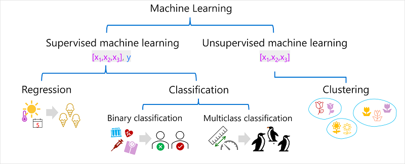

## 🤔 Apa itu machine learning 
Machine learning (ML) adalah cabang dari kecerdasan buatan (AI) yang memungkinkan komputer untuk belajar dari data dan meningkatkan performanya dari waktu ke waktu tanpa diprogram secara eksplisit untuk setiap tugas.

Ide dasar ml adalah menggunakan data dari pengamatan masa lalu untuk memprediksi hasil atau nilai yang tidak diketahui. contoh nya Seorang dokter mungkin menggunakan data klinis dari pasien sebelumnya untuk menjalankan tes otomatis yang memprediksi apakah pasien baru berisiko terkena diabetes berdasarkan faktor-faktor seperti berat badan, kadar glukosa darah, dan pengukuran lainnya.

## 🔎 Jenis-jenis pembelajaran mesin

### 🙂 Supervised machine learning
Supervised ML adalah istilah algoritma ML yang data pelatihannya mencakup nilai *feature* dan *nilai* label yang diketahui.

**Regression:** Merupakan bentuk supervised ML di mana label yang diprediksi oleh model adalah nilai numerik

**Classification:** Merupakan bentuk supervised ML di mana label mewakili kategorisasi atau class.

### 😌 Unsupervised machine learning
Unsupervised ML melibatkan model pelatihan menggunakan data yang hanya terdiri dari nilai fitur tanpa label yang diketahui.

**Clustering:** Algoritma pengelompokan mengidentifikasi kesamaan antara pengamatan berdasarkan fiturnya, dan mengelompokkannya ke dalam kelompok terpisah.

### ⚔️ Supervised vs Unsupervised
Supervised ML membutuhkan data pelatihan yang berlabel, sedangkan unsupervised ML tidak. Supervised ML digunakan untuk prediksi dan klasifikasi, sedangkan unsupervised ML digunakan untuk menemukan pola atau struktur dalam data.
